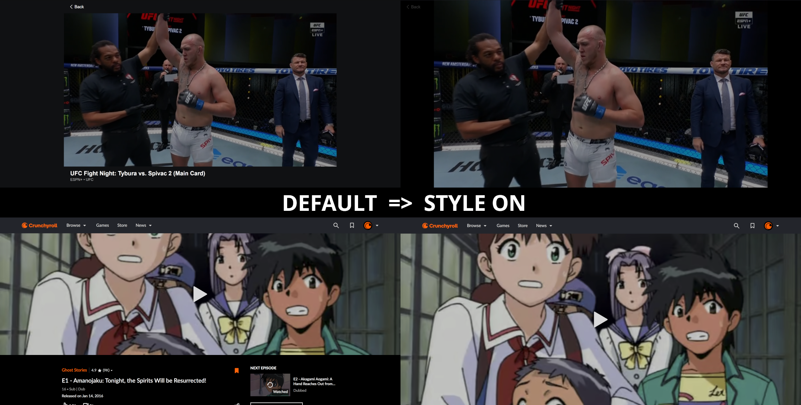

# Fix Bad Video Players

The internet is full of video players that are bad for no reason.

I try to fix them.

## Preview

## How To Install

1. Install `Stylus` Extension
   - [Chrome](https://chrome.google.com/webstore/detail/stylus/clngdbkpkpeebahjckkjfobafhncgmne)
   - [Firefox](https://addons.mozilla.org/firefox/addon/styl-us/)
   - [Source Code](https://github.com/openstyles/stylus)
2. Install [This Style](https://userstyles.world/style/15663/fix-bad-video-players)

## Issues And Feature Requests

Please submit any issues or feature requests to the [Issues Tab](https://github.com/JacobRothDevelopment/fix-bad-video-players/issues)

## Project Goals And Guidelines

- Margins around video players are stupid
  - Video player should fill browser height and width as much as possible
- Obstructing video players is stupid
  - Obstructions (i.e. logos) are kept minimal and in the corners of video player
- Extra functionality is always secondary to the video player
  - Menus are kept separate
  - Site actions are hidden or are given a light opacity
  - Video info, comments, and video recommendations should be scrolled to
- Any modification to the site should not obstruct the desired experience intended by the original developers
  - Use `display: none;` with discretion
  - Additional content with `:before` and `:after` is fine as long as it remains minimal
